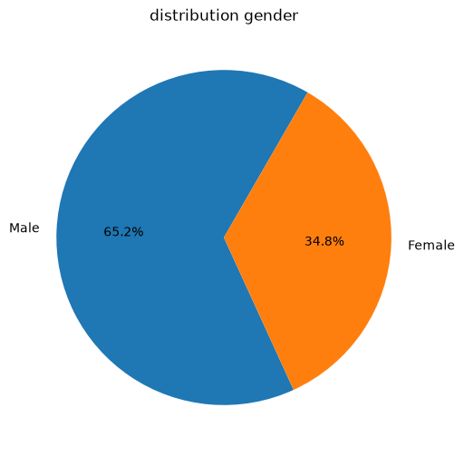
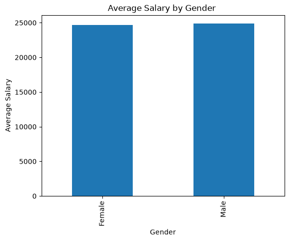
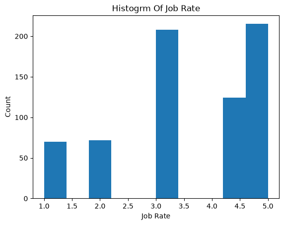
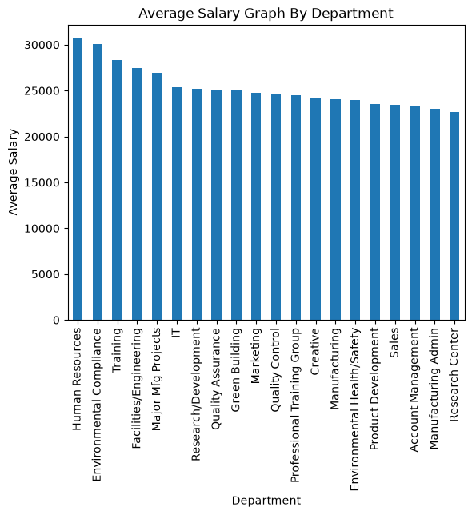
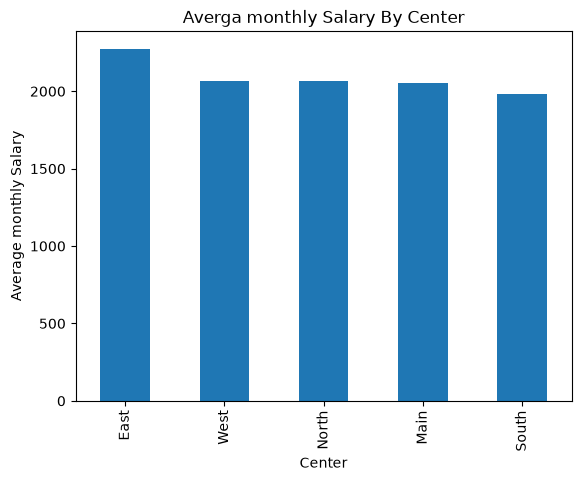
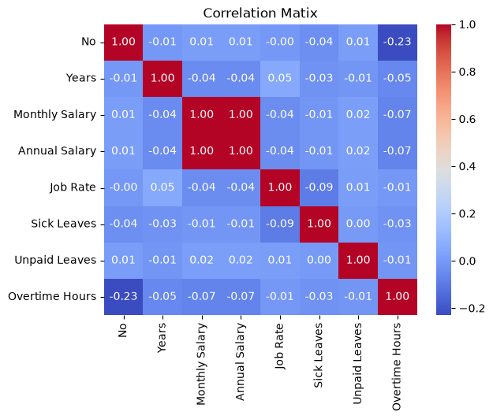
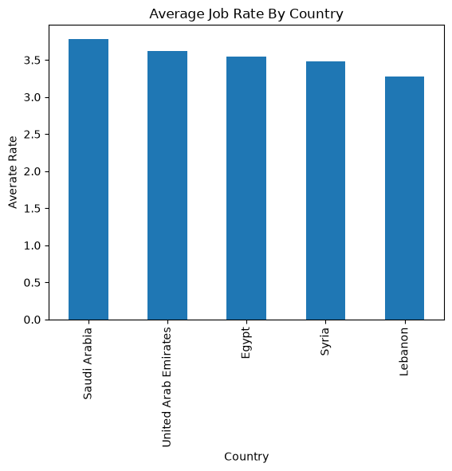
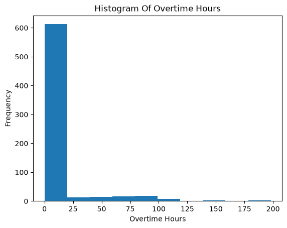

# Employee Salary Prediction Using Machine Learning
---
## 1. Title Page
---
## _Employee Salary Prediction Using Linear Regression_

- Project Type: Data Science / Machine Learning
- Domain: Employee Salary Analysis
- Machine Learning Algorithm: Linear Regression


## 2. Abstract
---
This project focuses on analyzing employee salary data and developing a Machine Learning model to predict an employee's Monthly Salary. The project uses an employee dataset containing information such as gender, years of experience, department, country, center, job rate, overtime hours, monthly salary, and annual salary.

The project begins with Exploratory Data Analysis (EDA) to understand the structure, distribution, and relationships within the dataset. Various statistical analyses and visualizations are performed to identify salary patterns across gender, departments, centers, and countries. Correlation analysis is also performed to understand relationships between numerical variables.

After completing the analysis, Years and Job Rate are selected as input features, while Monthly Salary is used as the target variable. The dataset is divided into training and testing datasets using an 80:20 ratio. A Linear Regression model is then trained and used to predict Monthly Salary.

The model is evaluated using MAE, MSE, RMSE, and R² Score. The project demonstrates a complete Data Science workflow from data analysis to Machine Learning model evaluation.

## 3. Table of Contents
---
```
- Abstract
- Introduction
- Problem Statement
- Objectives
- Dataset Description
- Tools & Technologies
- Methodology
- Data Cleaning
- Exploratory Data Analysis
- Insights & Visualizations
- Results / Output
- Challenges
- Recommendations
- Conclusion
- Future Scope
- Project Structure
```
## 4. Introduction
---

Employee salary analysis is an important application of Data Science because salary can vary depending on several factors such as experience, job level, department, location, and working conditions.

Organizations can use salary analysis to understand employee compensation patterns, identify salary differences between departments or locations, and support better workforce planning.

In this project, an employee salary dataset is analyzed using Python. Exploratory Data Analysis is performed to understand employee characteristics and salary distributions. Different visualizations are used to identify patterns and relationships within the data.

Machine Learning is then applied to predict Monthly Salary using selected employee-related features.

The project provides practical experience in data analysis, visualization, feature selection, Machine Learning, and model evaluation.

## 5. Problem Statement
---
Organizations maintain large amounts of employee information, but understanding salary patterns from this data can be difficult without proper analysis.

The objective of this project is to analyze employee salary data and develop a Machine Learning model that can predict an employee's Monthly Salary based on selected features such as Years of experience and Job Rate.

The project also aims to identify salary patterns across different genders, departments, centers, and countries.

## 6. Objectives
---
The main objectives of this project are:

- Analyze the employee salary dataset.
- Understand the structure and characteristics of employee data.
- Check missing values and duplicate records.
- Analyze employee distribution by gender.
- Analyze average salary by gender.
- Analyze average salary across departments.
- Analyze average monthly salary across centers.
- Analyze Job Rate distribution.
- Analyze Job Rate across countries.
- Analyze Overtime Hours distribution.
- Identify relationships between numerical variables.
- Select relevant features for Machine Learning.
- Build a Linear Regression model.
- Predict Monthly Salary.
- Compare actual and predicted salary values.
- Evaluate model performance using regression metrics.

## 7. Dataset Description
---
Dataset Source

The project uses an Employee Salary Dataset stored in Excel format.

Dataset File: Employees.xlsx

The dataset is stored inside the project's data folder.

Note: If you have the original Kaggle dataset URL, add it here:

Dataset Source: [https://www.kaggle.com/datasets/abdallahwagih/company-employees]

- Dataset Format
- File Format: Excel (.xlsx)
- Number of Rows: 689
- Number of Columns: 15
- Variables Included

The dataset contains the following employee-related variables:

- Column	Description
- No	Employee record number
- First Name	Employee first name
- Last Name	Employee last name
- Gender	Employee gender
- Start Date	Employee starting date
- Years	Years of experience
- Department	Employee department
- Country	Employee country
- Center	Employee work center
- Monthly Salary	Employee monthly salary
- Annual Salary	Employee annual salary
- Job Rate	Employee job rate
- Sick Leaves	Number of sick leave days
- Unpaid Leaves	Number of unpaid leave days
- Overtime Hours	Employee overtime hours

## 8. Tools & Technologies Used
---
- Category	Technologies
- Programming Language	:- Python
- Lybraies :-	Pandas, NumPy,	Matplotlib, Seaborn
- Machine Learning:-	Scikit-learn
- Algorithm	Linear Regression
- Development Environment :	VS Code / Jupyter Notebook


## 9. Methodology
---
The project follows a complete Data Science and Machine Learning workflow.

### Step 1: Data Collection

The Employee Salary dataset is obtained in Excel format and stored in the project data folder.

### Step 2: Data Loading

The dataset is loaded into a Pandas DataFrame for analysis.

### Step 3: Data Understanding

The dataset is examined using:

- First and last records
- Dataset dimensions
- Column names
- Data types
- Non-null values
- Descriptive statistics

### Step 4: Data Quality Checking

The dataset is checked for:

- Missing values
- Duplicate records
- Data types
- Unique categorical values

### Step 5: Exploratory Data Analysis

Different statistical analyses and visualizations are performed to understand employee and salary patterns.

### Step 6: Feature Selection

The following features are selected:

- Years
- Job Rate
### Step 7: Target Selection

The target variable selected for prediction is:

- Monthly Salary
### Step 8: Train-Test Split

The dataset is divided into:

- 80% Training Data
- 20% Testing Data

### Step 9: Model Building

A Linear Regression model is trained using the selected features.

### Step 10: Prediction

The trained model predicts Monthly Salary for the test dataset.

### Step 11: Model Evaluation

The model is evaluated using:

- MAE
- MSE
- RMSE
- R² Score

### Step 12: Result Analysis

Actual salary values are compared with predicted salary values to understand model performance.

## 10. Data Cleaning
---
Before building the Machine Learning model, the dataset is inspected for data quality issues.

The following checks are performed:

#### Missing Values

The dataset is checked for null or missing values across all columns.

#### Duplicate Records

The dataset is checked for duplicate employee records.

#### Data Types

Column data types are examined to ensure that numerical and categorical variables are correctly identified.

#### Unique Values

Categorical columns such as Gender are examined to understand their unique values.

#### Statistical Validation

Descriptive statistics are used to understand the minimum, maximum, average, and distribution of numerical variables.

## 11. Exploratory Data Analysis
---
Exploratory Data Analysis is performed to understand employee characteristics and salary patterns.

#### 11.1 Gender Distribution



The Gender column is analyzed to determine the number and percentage of male and female employees.

A Pie Chart is used to visualize gender distribution.

#### 11.2 Average Salary by Gender



The average Annual Salary is calculated for each gender.

A Bar Chart is used to compare the average salary between male and female employees.

#### 11.3 Job Rate Distribution



The distribution of Job Rate is analyzed using a Histogram.

Descriptive statistics are also calculated for the Job Rate column.

#### 11.4 Department-Wise Salary Analysis



The average Annual Salary is calculated for each department.

Departments are sorted in descending order according to their average salary.

A Bar Chart is used to visualize the results.

#### 11.5 Center-Wise Monthly Salary Analysis



The average Monthly Salary is calculated for each center.

The results are sorted in descending order and visualized using a Bar Chart.

#### 11.6 Correlation Analysis



A correlation matrix is calculated for numerical variables.

A Correlation Heatmap is used to visualize relationships between numerical features.

The correlation of numerical variables with Annual Salary is also analyzed.

#### 11.7 Country-Wise Job Rate Analysis



The average Job Rate is calculated for each country.

The results are sorted in descending order and displayed using a Bar Chart.

#### 11.8 Overtime Hours Analysis



The distribution of employee Overtime Hours is analyzed using a Histogram.

Descriptive statistics are also calculated to understand overtime patterns.
#### 11.9 Linear Regression


## 12. Insights & Visualizations
---
The project generates several visualizations to understand employee and salary patterns.


### The visualizations help analyze:

- Employee gender distribution
- Salary differences by gender
- Job Rate distribution
- Department-wise salary differences
- Center-wise salary differences
- Country-wise Job Rate differences
- Overtime patterns
- Relationships between numerical variables
- Actual vs predicted salary performance

## 13. Results / Output
---
The project produces the following outputs:

- Data Analysis Output
- Dataset structure and statistical summary
- Missing-value analysis
- Duplicate-value analysis
- Gender distribution
- Department-wise salary analysis
- Center-wise salary analysis
- Country-wise Job Rate analysis
- Overtime Hours analysis
- Correlation analysis
- Machine Learning Output

#### A Linear Regression model is trained using:

### Input Features:
  "Years", "Job Rate"

### Target:
 "Monthly Salary"

#### The model is evaluated using:

- Mean Absolute Error (MAE)
- Mean Squared Error (MSE)
- Root Mean Squared Error (RMSE)
- R² Score
- Model Performance


Important: Do not add estimated values here. Use the exact values generated by your final notebook/model.

## 14. Challenges
---
During the project, several challenges were considered:

#### 1. Selecting Relevant Features

The dataset contains multiple employee-related columns. Selecting the most appropriate features for the initial Linear Regression model was an important step.

#### 2. Understanding Salary Relationships

Salary can depend on several factors, making it necessary to analyze correlations and group-level salary patterns before modeling.

#### 3. Categorical Variables

Columns such as Gender, Department, Country, and Center contain categorical information and require appropriate preprocessing if they are included in future Machine Learning models.

#### 4. Model Performance

Using only two features may limit the ability of the model to explain variations in Monthly Salary.

#### 5. Visualization

Different types of charts were required to understand different aspects of the dataset, including distributions, comparisons, and correlations.

## 15. Recommendations
---
Based on the project analysis, the following improvements are recommended:
```
- Include additional relevant employee features in the prediction model.
- Perform proper encoding of categorical variables.
- Analyze the impact of Department and Country on salary.
- Include Overtime Hours as a potential predictive feature.
- Compare multiple Machine Learning algorithms.
- Perform feature engineering.
- Use cross-validation for more reliable model evaluation.
- Perform hyperparameter tuning for advanced models.
- Monitor model performance when new employee data becomes available.
```
## 16. Conclusion
---
This project demonstrates an end-to-end Employee Salary Analysis and Prediction workflow using Python and Machine Learning.

The project begins with loading and understanding the employee dataset, followed by data quality checks and Exploratory Data Analysis. Various visualizations are created to understand employee gender distribution, salary differences across departments and centers, Job Rate distribution, country-wise Job Rate, overtime patterns, and relationships between numerical variables.

After EDA, Years and Job Rate are selected as input features and Monthly Salary is selected as the target variable. An 80:20 train-test split is used to divide the data into training and testing sets.

A Linear Regression model is then trained and used to predict Monthly Salary. The model is evaluated using MAE, MSE, RMSE, and R² Score.

Overall, this project provides practical experience in Python, Pandas, NumPy, Data Visualization, Exploratory Data Analysis, Linear Regression, and Machine Learning model evaluation.

## 17. Future Scope
---
The project can be further improved in the following ways:
```
Add more relevant features to the prediction model.
Apply categorical encoding techniques.
Perform feature engineering.
Compare Linear Regression with other regression algorithms.
Implement Random Forest Regression.
Implement Gradient Boosting Regression.
Implement XGBoost Regression.
Perform hyperparameter tuning.
Apply cross-validation.
Build an interactive salary prediction application.
Deploy the Machine Learning model.
Create an interactive dashboard using Power BI.
Automate prediction using new employee data.
Monitor model performance over time.
```
## 18. Project Structure
---
```
Employee Salary Prediction Projects/
│
├── data/
│   └── Employees.xlsx
│
├── model/
│   └── linearmodel.pkl
│
├── notebook/
│   └── Salary prediction-1.ipynb
│
├── output/
│   └── images/
│       ├── Average Job Rate By Country.png
│       ├── Average Salary by Gender.png
│       ├── Average Salary Graph By Department.png
│       ├── Averga monthly Salary By Center.png
│       ├── Correlation Matix.png
│       ├── Gender Distribution.jpg
│       ├── Histogram Of Overtime Hours.png
│       ├── Histogram of Job Rate.png
│       └── Linear Regression Annual Salary vs Experience.png
│
├── app.py
├── readme.md
├── requirements.txt
└── Train_model.py
```

## Project Files
File / Folder	Description
```
data/	Contains the employee dataset

Employees.xlsx	Employee salary dataset

model/	Stores the trained Machine Learning model

notebook/	Contains the project Jupyter Notebook

Salary prediction-1.ipynb	EDA, visualization, model training, prediction, and evaluation

output/	Stores generated project outputs

app.py	Application for the salary prediction project

read.md	Project documentation

requirements.txt	Required Python libraries

Train_model.py	Script for training the Machine Learning model
```


